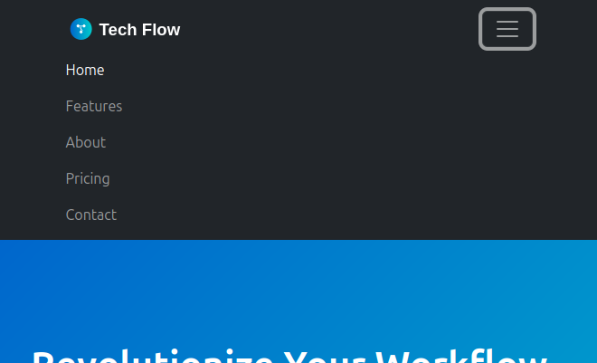

# TechFlow Landing Page - Advanced Bootstrap Lab

Welcome to the Advanced Bootstrap Lab! In this project, you'll build a professional landing page for **TechFlow**, a cutting-edge AI startup. You'll master Bootstrap's grid system, components, and responsive utilities to create a portfolio-worthy website.

## 🚀 What You'll Build

By the end of this lab, you'll have created a fully responsive startup landing page featuring:
- Professional navigation with mobile toggle
- Eye-catching hero section with call-to-action
- Feature showcase with cards and icons
- Team member profiles
- Pricing table
- Responsive footer

## 📋 Prerequisites

- Basic HTML structure knowledge
- Understanding of CSS concepts
- Familiarity with Bootstrap grid basics
- Knowledge of Bootstrap components

## 🎯 Learning Objectives

After completing this lab, you will be able to:
- Build complex layouts using Bootstrap's grid system
- Create responsive designs that work on all devices
- Implement Bootstrap components effectively
- Use utility classes for spacing and alignment
- Structure a professional website without custom CSS

## 🏗️ Project Structure

```
/
├── starter-files/
│   ├── index.html          # Your working file
│   ├── content.txt         # All text content
│   └── design-reference.md # Visual mockup
├── assets/
│   └── images/             # All project images
├── checkpoints/            # Visual progress indicators
├── solution/               # Complete solution (for reference)
└── tests/                  # Automated validation
```

## 🎨 Design System

**Color Palette:**
- Primary: `#0066cc` (Bootstrap primary)
- Secondary: `#00cccc` (Bootstrap info)
- Dark: `#1a1a1a` (Bootstrap dark)
- Light: `#f8f9fa` (Bootstrap light)

**Typography:**
- Use Bootstrap's default font stack
- Optional: Add Google Fonts for headings

## 🛠️ Getting Started

### Step 1: Set Up Your Environment
1. Open `starter-files/index.html` in your code editor
2. Open the file in your browser to see changes live
3. Keep the browser and editor side by side for instant feedback

### Step 2: Review the Content
- Check `starter-files/content.txt` for all text content
- Familiarize yourself with the provided images in `assets/images/`
- Optional: Look at `design-reference.md` for visual guidance

### Step 3: Start Building!
Follow the phases below in order. Each phase builds on the previous one.

---

## 📝 Phase 1: Foundation & Navigation (30 minutes)

### Your Mission
Create a professional navigation bar that works perfectly on all devices.

### Requirements
- Use Bootstrap's `navbar` component ([Documentation](https://getbootstrap.com/docs/5.0/components/navbar/))
- Include the TechFlow logo and 5 navigation items
- Make it responsive with a mobile toggle
- Apply dark theme styling
- Use proper container for spacing

### Navigation Items
- Home
- Features
- About
- Pricing
- Contact

### Success Criteria
✅ Navigation displays horizontally on desktop
✅ Navigation collapses to hamburger menu on mobile
✅ All links are visible and clickable
✅ Dark theme is applied correctly
✅ Logo is properly positioned

<details>
<summary>💡 Hint: Getting Started</summary>

Start with the `navbar` component from Bootstrap documentation. Remember to:
1. Use `navbar-expand-lg` for responsive behavior
2. Add `navbar-dark bg-dark` for dark theme
3. Include `navbar-toggler` for mobile menu
4. Wrap content in `container` for proper spacing

</details>

<details>
<summary>💡 Hint: Mobile Toggle</summary>

The mobile toggle requires:
1. A `navbar-toggler` button with `data-bs-toggle="collapse"`
2. A `navbar-collapse` div with unique ID
3. The button should target the collapse div with `data-bs-target="#navbarNav"`

</details>

### Checkpoint
When complete, your navigation should look like the image in `checkpoints/phase-1-complete.png`

Mobile:



Desktop:


---

## 📝 Phase 2: Hero Section & Grid Mastery (40 minutes)

### Your Mission
Create a compelling hero section that showcases TechFlow's value proposition.

### Requirements
- Full-width hero section with background image
- Two-column layout: text content left, image right
- Call-to-action buttons with proper styling
- Responsive design (stacks on mobile)
- Proper spacing and alignment

### Hero Content
- **Headline**: "Revolutionize Your Workflow with AI"
- **Subheadline**: "TechFlow's cutting-edge AI solutions streamline your processes, boost productivity, and drive innovation across your entire organization."
- **Buttons**: "Get Started" (primary), "Learn More" (secondary)
- **Hero Image**: Use `hero-bg.jpg` from assets

### Success Criteria
✅ Hero section spans full width
✅ Content is properly aligned in two columns
✅ Buttons are styled and sized correctly
✅ Layout stacks vertically on mobile
✅ Background image displays properly

<details>
<summary>💡 Hint: Grid Layout</summary>

Use Bootstrap's grid system ([Documentation](https://getbootstrap.com/docs/5.0/layout/grid/)):
1. Create a `container-fluid` for full width
2. Use `row` and `col-lg-6` classes
3. Remember `d-flex align-items-center` for vertical centering
4. Consider `min-vh-100` for full viewport height

</details>

<details>
<summary>💡 Hint: Responsive Images</summary>

Make images responsive with:
- `img-fluid` class for responsive scaling
- `w-100` if you need full width
- Consider `d-none d-md-block` to hide on small screens

</details>

### Checkpoint
When complete, your hero section should look like the image in `checkpoints/phase-2-complete.png`


---

## 📝 Phase 3: Component Integration (50 minutes)

### Your Mission
Build three distinct sections using different Bootstrap components to showcase TechFlow's offerings.

## Section 3A: Features (20 minutes)

### Requirements
- Three-column card layout ([Documentation](https://getbootstrap.com/docs/5.0/components/card/))
- Icons, headings, and descriptions
- Equal height cards
- Responsive (stacks on mobile)

### Feature Content
1. **AI-Powered Analytics** (icon: chart-bar)
2. **Seamless Integration** (icon: plug)
3. **24/7 Support** (icon: headset)

<details>
<summary>💡 Hint: Equal Height Cards</summary>

Use `h-100` class on cards and `d-flex flex-column` with `card-body` for equal heights.

</details>

## Section 3B: Team/About (15 minutes)

### Requirements
- Team member cards with photos
- Responsive grid (3 on desktop, 1 on mobile)

### Team Members
- Sarah Johnson (CEO)
- Mike Chen (CTO)
- Lisa Rodriguez (Head of Design)

## Section 3C: Pricing (15 minutes)

### Requirements
- Pricing table using cards
- Highlight recommended plan
- Different button variants for actions

### Pricing Plans
- **Starter**: $29/month
- **Professional**: $79/month (recommended)
- **Enterprise**: Custom pricing

<details>
<summary>💡 Hint: Highlighting Plans</summary>

Use `border-primary` and `text-primary` classes to highlight the recommended plan.

</details>

### Success Criteria
✅ All three sections are properly spaced
✅ Cards have consistent styling
✅ Responsive layout works on all devices
✅ Icons and images display correctly
✅ Hover effects work smoothly

### Checkpoint
When complete, your page should look like the image in `checkpoints/phase-3-complete.png`


---

## 📝 Phase 4: Polish & Responsive Refinement (30 minutes)

### Your Mission
Add the finishing touches and ensure perfect mobile experience.

### Requirements
- Multi-column footer with company info and links
- Consistent spacing using Bootstrap utilities
- Responsive utility classes to optimize mobile
- Fine-tune the mobile experience
- Add any final polish

### Footer Content
- **Company Info**: Logo, description, contact
- **Quick Links**: Home, Features, About, Pricing
- **Social Links**: Twitter, LinkedIn, GitHub
- **Copyright**: © 2025 TechFlow. All rights reserved.

### Success Criteria
✅ Footer has proper column layout
✅ Spacing is consistent throughout
✅ Mobile experience is optimized
✅ Page looks professional and polished

<details>
<summary>💡 Hint: Responsive Utilities</summary>

Use classes like:
- `d-none d-md-block` to hide on mobile
- `d-block d-md-none` to show only on mobile
- `text-center text-md-start` for responsive alignment

</details>

<details>
<summary>💡 Hint: Spacing Utilities</summary>

Bootstrap spacing utilities:
- `my-5` for vertical margins
- `py-4` for padding top/bottom
- `mb-3` for margin bottom
- `pe-md-4` for responsive padding

</details>

### Final Checkpoint
When complete, your page should look like the image in `checkpoints/phase-4-complete.png`


---

## 🧪 Testing Your Work

### Manual Testing Checklist
- [ ] Navigation works on desktop and mobile
- [ ] Hero section is responsive
- [ ] All cards display properly
- [ ] Images load correctly
- [ ] Footer is properly formatted
- [ ] Page works at 320px, 768px, 1024px, 1440px widths

### Automated Testing
Run the validation script to check your HTML structure:
```bash
npm test
```

or, for more detailed output:
```bash
npm run test:verbose
```

### Cross-Browser Testing
Test your page in:
- Chrome
- Firefox
- Safari (if available)
- Mobile browsers

---

## 🏆 Congratulations!

You've successfully built a professional landing page using only Bootstrap! Your page demonstrates:

- **Responsive Design**: Works perfectly on all devices
- **Professional Layout**: Clean, modern design
- **Best Practices**: Semantic HTML and proper Bootstrap usage
- **Portfolio Ready**: Something you can proudly show to employers

## 🚀 Next Steps

### Portfolio Enhancement
- Add this project to your portfolio
- Customize colors and fonts to match your personal brand
- Create variations for different industries

### Advanced Challenges
- Implement dark mode toggle using Bootstrap utilities
- Add loading animations with Bootstrap spinners
- Create alternate layouts for different screen sizes
- Enhance accessibility with ARIA labels

### Learning Resources
- [Bootstrap Documentation](https://getbootstrap.com/docs/5.3/)
- [Bootstrap Examples](https://getbootstrap.com/docs/5.3/examples/)
- [Responsive Design Principles](https://web.dev/responsive-web-design-basics/)

---

## 📞 Need Help?

### Common Issues
- **Navigation not collapsing**: Check your `data-bs-` attributes
- **Images not showing**: Verify file paths are correct
- **Layout breaking**: Ensure you're using proper Bootstrap classes
- **Mobile issues**: Test responsive utilities and grid classes

### Getting Support
- Review the Bootstrap documentation
- Check the solution files for reference
- Ask questions during office hours
- Pair program with a classmate

---

**Happy coding! 🎉**

*Remember: The best way to learn Bootstrap is by building. Don't be afraid to experiment and try different approaches!*
