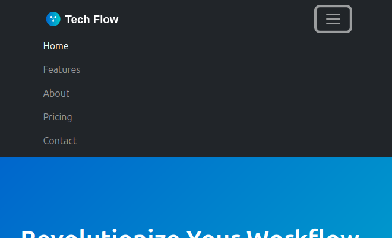
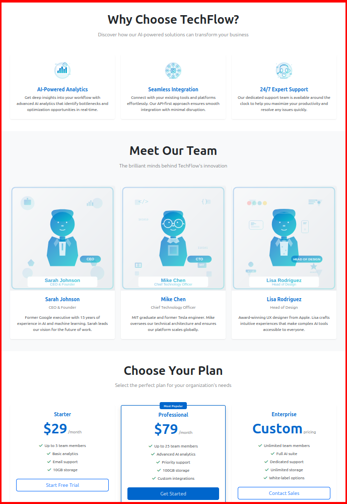
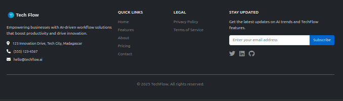

# TechFlow Landing Page - Implementation Guide

Welcome to the Advanced Bootstrap Lab implementation guide! This document contains the step-by-step instructions for building the TechFlow landing page.

> **See [Overview](../README.md) for project description, learning objectives, and general information.**

## Getting Started

### Step 1: Set Up Your Environment
1. Open `lab/starter-files/index.html` in your code editor
2. Open the file in your browser to see changes live
3. Keep the browser and editor side by side for instant feedback

### Step 2: Review the Content
- Check `lab/starter-files/content.txt` for all text content
- Familiarize yourself with the provided images in `assets/images/`
- Optional: Look at `design-reference.md` for visual guidance

### Step 3: Start Building!
Follow the phases below in order. Each phase builds on the previous one.

---

## Phase 1: Foundation & Navigation (30 minutes)

### Your Mission
Create a professional navigation bar that works perfectly on all devices.

### Requirements
- Use Bootstrap's `navbar` component ([Documentation](https://getbootstrap.com/docs/5.0/components/navbar/))
- Include the TechFlow logo and 5 navigation items
- Make it responsive with a mobile toggle
- Apply dark theme styling
- Use proper container for spacing

### Navigation Items
- Home
- Features
- About
- Pricing
- Contact

### Success Criteria
- Navigation displays horizontally on desktop
- Navigation collapses to hamburger menu on mobile
- All links are visible and clickable
- Dark theme is applied correctly
- Logo is properly positioned

<details>
<summary>Hint: Getting Started</summary>

Start with the `navbar` component from Bootstrap documentation. Remember to:
1. Use `navbar-expand-lg` for responsive behavior
2. Add `navbar-dark bg-dark` for dark theme
3. Include `navbar-toggler` for mobile menu
4. Wrap content in `container` for proper spacing

</details>

<details>
<summary>Hint: Mobile Toggle</summary>

The mobile toggle requires:
1. A `navbar-toggler` button with `data-bs-toggle="collapse"`
2. A `navbar-collapse` div with unique ID
3. The button should target the collapse div with `data-bs-target="#navbarNav"`

</details>

### Checkpoint
When complete, your navigation should look like the image in `assets/checkpoints/phase-1-complete.png`

Mobile:



Desktop:


---

## Phase 2: Hero Section & Grid Mastery (40 minutes)

### Your Mission
Create a compelling hero section that showcases TechFlow's value proposition.

### Requirements
- Full-width hero section with background image
- Two-column layout: text content left, image right
- Call-to-action buttons with proper styling
- Responsive design (stacks on mobile)
- Proper spacing and alignment

### Hero Content
- **Headline**: "Revolutionize Your Workflow with AI" (display-4 class)
- **Subheadline**: "TechFlow's cutting-edge AI solutions streamline your processes, boost productivity, and drive innovation across your entire organization." (lead class)
- **Buttons**: "Get Started" (btn btn-primary), "Learn More" (btn btn-secondary)
- **Hero Image**: Use `hero-bg.jpg` from assets
- **Background**: Use the following custom inline css on your full-height hero element to achieve the gradient background:
` style="background: linear-gradient(135deg, var(--primary-color) 0%, var(--secondary-color) 100%);" `

### Success Criteria
- Hero section spans full width (`container-fluid`)
- Content is properly aligned in two columns (`row` and `col-lg-6`)
- Buttons are styled and sized correctly
- Layout stacks vertically on mobile
- Background image displays properly (use `img-fluid` class)

<details>
<summary>Hint: Grid Layout</summary>

Use Bootstrap's grid system ([Documentation](https://getbootstrap.com/docs/5.0/layout/grid/)):
1. Create a `container-fluid` for full width
2. Use `row` and `col-lg-6` classes
3. Remember `d-flex align-items-center` for vertical centering
4. Consider `min-vh-100` for full viewport height

</details>

<details>
<summary>Hint: Responsive Images</summary>

Make images responsive with:
- `img-fluid` class for responsive scaling
- `w-100` if you need full width
- Consider `d-none d-md-block` to hide on small screens

</details>

### Checkpoint
When complete, your hero section should look like the image in `../assets/checkpoints/phase-2-complete.png`


---

## Phase 3: Component Integration (50 minutes)

### Your Mission
Build three distinct sections using different Bootstrap components to showcase TechFlow's offerings.

## Section 3A: Features (20 minutes)

### Requirements
- Three-column card layout ([Documentation](https://getbootstrap.com/docs/5.0/components/card/))
- Icons, headings, and descriptions
- Equal height cards
- Responsive (stacks on mobile)
- Find the text in `lab/starter-files/content.txt` and the icons in `assets/images/`

### Feature Content
1. **AI-Powered Analytics** (icon: chart-bar)
2. **Seamless Integration** (icon: plug)
3. **24/7 Support** (icon: headset)

<details>
<summary>Hint: Equal Height Cards</summary>

Use `h-100` class on cards and `d-flex flex-column` with `card-body` for equal heights.

</details>

## Section 3B: Team/About (15 minutes)

### Requirements
- Team member cards with photos
- Responsive grid (3 on desktop, 1 on mobile)

### Team Members
- Sarah Johnson (CEO)
- Mike Chen (CTO)
- Lisa Rodriguez (Head of Design)

## Section 3C: Pricing (15 minutes)

### Requirements
- Pricing table using cards
- Highlight recommended plan
- Different button variants for actions

### Pricing Plans
- **Starter**: $29/month
- **Professional**: $79/month (recommended)
- **Enterprise**: Custom pricing

<details>
<summary>Hint: Highlighting Plans</summary>

Use `border-primary` and `text-primary` classes to highlight the recommended plan.

</details>

### Success Criteria
- All three sections are properly spaced
- Cards have consistent styling
- Responsive layout works on all devices
- Icons and images display correctly

### Checkpoint
When complete, your page should look like the image in `../assets/checkpoints/phase-3-complete.png`


---

## Phase 4: Polish & Responsive Refinement (30 minutes)

### Your Mission
Add the finishing touches and ensure perfect mobile experience.

### Requirements
- Multi-column footer with company info and links
- Consistent spacing using Bootstrap utilities
- Responsive utility classes to optimize mobile
- Fine-tune the mobile experience
- Add any final polish

### Footer Content
- **Company Info**: Logo, description, contact
- **Quick Links**: Home, Features, About, Pricing
- **Social Links**: Twitter, LinkedIn, GitHub
- **Copyright**: © 2025 TechFlow. All rights reserved.

### Success Criteria
- Footer has proper column layout
- Spacing is consistent throughout
- Mobile experience is optimized
- Page looks professional and polished

<details>
<summary>Hint: Responsive Utilities</summary>

Use classes like:
- `d-none d-md-block` to hide on mobile
- `d-block d-md-none` to show only on mobile
- `text-center text-md-start` for responsive alignment

</details>

<details>
<summary>Hint: Spacing Utilities</summary>

Bootstrap spacing utilities:
- `my-5` for vertical margins
- `py-4` for padding top/bottom
- `mb-3` for margin bottom
- `pe-md-4` for responsive padding

</details>

### Final Checkpoint
When complete, your page should look like the image in `../assets/checkpoints/phase-4-complete.png`


---

## Testing Your Work

### Manual Testing Checklist
- [ ] Navigation works on desktop and mobile
- [ ] Hero section is responsive
- [ ] All cards display properly
- [ ] Images load correctly
- [ ] Footer is properly formatted
- [ ] Page works at 320px, 768px, 1024px, 1440px widths

### Automated Testing
Run the validation script to check your HTML structure from the project root:
```bash
npm test
```

or, for more detailed output:
```bash
npm run test:verbose
```

**Note**: Since `package.json` is now in the project root, run these commands from the root directory (one level up from the lab folder).

### Cross-Browser Testing
Test your page in:
- Chrome
- Firefox
- Safari (if available)
- Mobile browsers

---

## Need Help?

### Common Issues
- **Navigation not collapsing**: Check your `data-bs-` attributes
- **Images not showing**: Verify file paths are correct
- **Layout breaking**: Ensure you're using proper Bootstrap classes
- **Mobile issues**: Test responsive utilities and grid classes

### Getting Support
- Review the [Bootstrap documentation](https://getbootstrap.com/docs/5.3/)
- Check the solution file for reference
- Pair program with a classmate
